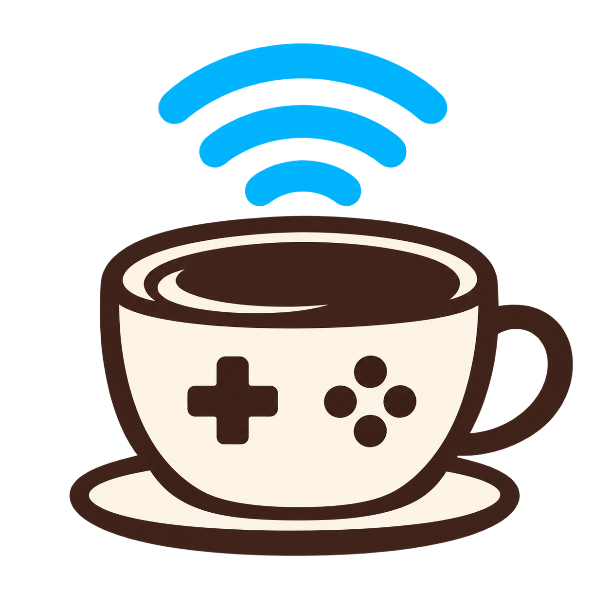

# Barista

<p align="center"></p>

Barista lets a Wii U GamePad act as a wireless second screen, controller, and
audio device for a desktop application. It owns pairing, the dedicated Wi-Fi
access point, low-latency media delivery, GamePad input, and a Qt 6 desktop
application. It is not affiliated with Nintendo.

## What it does

- Pair and reconnect a real Wii U GamePad from the desktop app.
- Show Barista's logo while no application is streaming.
- Run in **Screen + controller** mode: an application sends video/audio to the
  GamePad and receives its input.
- Run in **Controller-only** mode: expose standard buttons, sticks, triggers,
  and D-pad through Linux `uinput`.
- Keep the privileged radio/service work behind a D-Bus + polkit boundary; the
  Qt application runs as the regular desktop user.

The application connector is **AppHook**, internally nicknamed **MUG** (Media
User Gateway). It is a Linux-local Unix `SOCK_SEQPACKET` protocol and is not
Cemu-specific. A client receives its session socket through
`BARISTA_MUG_SOCKET`, submits RGB video and stereo PCM, and receives GamePad
input. Cemu is the current working client; other applications can implement the
same AppHook instead of embedding any radio or pairing logic.

## Wi-Fi requirements

The GamePad uses a dedicated **5 GHz** access point. Barista needs a Linux Wi-Fi
adapter and driver that can create a 5 GHz AP using `nl80211`/hostapd, remain
stable at the selected channel, and support the GamePad's required association
and encryption behavior. This is not ordinary home Wi-Fi: starting a session
temporarily takes over the selected adapter from NetworkManager.

Use wired Ethernet or a second Wi-Fi adapter if the machine needs Internet
access while Barista is active. Keep the GamePad close to the adapter while
testing; radio conditions still directly affect video quality and latency.

Development and physical GamePad streaming were tested with the Realtek
**RTL8852BE** (`rtw89_8852be`) on Linux. That proves this adapter/driver can
work; it is not a guarantee for every firmware, kernel, access-point channel,
or adapter. macOS and Windows currently provide the portable UI/core only—the
real GamePad radio backend is Linux-only.

## Use

Install Barista, then open it normally from the desktop launcher. The system
service is activated on demand; use **Start** to authorize the Wi-Fi takeover.
Use **Pair GamePad** only when pairing is needed. Closing the window keeps it in
the tray by default.

The Advanced page displays the automatically managed AppHook endpoint and can
copy this launch prefix for a client application:

```sh
env BARISTA_MUG_SOCKET=/run/barista/media-<uid>.sock your-app
```

The endpoint exists only while a Screen + controller session is active. It is
owned and permissioned for the desktop user; applications must not run as root.

## Build and install

See [COMPILING.md](COMPILING.md) for dependencies, a development build, tests,
and system installation.

## Status

Barista is active development software. The primary Linux pairing, streaming,
and AppHook paths have been exercised with real hardware, but adapter/driver
compatibility and media recovery still need broader hardware testing.

### What's working

- Pairing
- Basic A/V streaming
- Inputs from buttons and sticks
- AppHook for third-party apps

### Needs work

- Video still has artifacts and can get behind and stutter.
- Audio occasionally stutters.
- The GamePad still requests recovery much more often than it does with a real
  Wii U connection.

### Not started

- Touch
- Camera
- Microphone
- Gyro
- NFC
