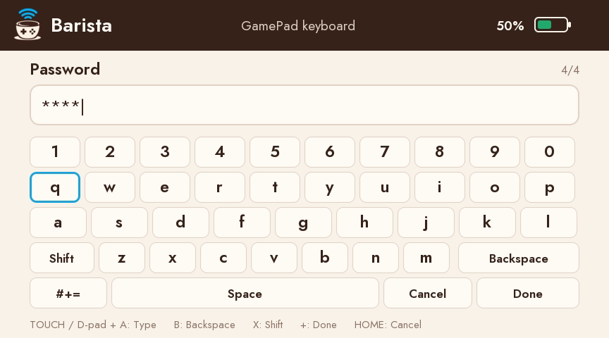

# Using Barista

[Back to README](../README.md)

Install Barista using the [build and installation guide](../COMPILING.md), then
open it from the desktop launcher as your normal user. The system service starts
on demand and handles privileged radio work. Do not run the GUI or connected
applications with `sudo` or `pkexec`.

## Before connecting

In **Settings → General**, select your Wi-Fi adapter, confirm the country matches
your physical location, and choose a play mode:

- **Screen + controller**: a compatible application sends video/audio to the
  GamePad and receives its input. Barista displays its logo while no application
  is streaming.
- **Controller-only**: exposes standard buttons, sticks, triggers, and D-pad
  through Linux `uinput`.
- **Desktop**: mirrors a monitor or application window and uses the sticks and
  buttons as a mouse and keyboard.

The selected adapter is dedicated to the GamePad during a session. Use Ethernet
or another adapter for Internet access. See [Wi-Fi compatibility](hardware.md).

## Pair a new GamePad

1. Turn on the GamePad and keep it near the adapter.
2. Open **GamePads → Pair a GamePad**, then select **Pair** and authorize the
   Wi-Fi takeover when prompted.
3. Wait while Barista checks the adapter and creates the network.
4. When **Pair now** and the four symbols appear, press SYNC on the GamePad and
   enter the symbols from left to right.

Each Barista launch generates a new pattern for new pairings. Existing GamePads
retain their saved credentials; a new pattern does not replace those credentials.

**Cancel**, Escape, or closing the pairing popup stops an in-progress pairing
session and releases the adapter. Closing the instructions without starting a
pair does not stop an existing connection.

## Reconnect and disconnect

Use **Connect GamePad** on Home to reconnect a saved GamePad. Home shows the
session, battery level when available, and connected application.

**Disconnect GamePad** ends the session and releases the adapter. Closing the
main window keeps Barista in the tray by default; change this in Settings.
**Quit Barista**, at the bottom of the sidebar or in the tray menu, stops the
session and exits.

## Desktop mode

1. Select **Desktop** in **Settings → General** before connecting.
2. Use **Connect GamePad**, then turn on your paired GamePad.
3. On Wayland, the system sharing picker opens when the GamePad connects.
   Select one monitor or application window and approve sharing.
   On X11, select the source in Settings before connecting.
4. Use **Choose monitor or window…** on Wayland to change the source or retry
   a cancelled picker. On X11, select a source and use **Share selected source**.
   **Stop sharing** ends capture and releases desktop input while
   keeping the GamePad connected.

| GamePad control | Desktop action |
| --- | --- |
| Left stick | Move cursor; small movements are slower |
| Right stick | Vertical and horizontal scrolling |
| A or ZR | Left mouse button; hold to drag |
| B or ZL | Right mouse button |
| Left stick click | Middle mouse button |
| Right stick click | Open the GamePad touch keyboard |
| D-pad | Arrow keys |
| Plus / Minus | Enter / Escape |
| Y / X | Tab / Backspace |

Input controls the desktop cursor and focused application. When sharing a
single window, click it to give it keyboard focus. The source is scaled to fit
the GamePad display with black bars as needed. Static scenes continue streaming.
On X11, keep the selected window visible: overlapping windows can appear in
the capture, and minimizing or closing the source stops sharing.
Click **GamePad keyboard** in Barista or press the right stick to enter text on
its built-in keyboard. Tap keys, or use D-pad + A; B deletes, X toggles Shift,
Plus submits and HOME cancels. Submitted text is typed into the focused desktop
application. This first desktop typing implementation accepts printable ASCII
and assumes a US host keyboard layout on both X11 and Wayland. Characters are
paced at one per 8-ms input tick, with each key and Shift released after use;
stop/disconnect/stale input cancels pending typing. Applications can instead
use [AppHook text prompts](api/media.md#gamepad-software-keyboard) for direct
UTF-8 results, initial text, length limits and password masking.

This initial desktop mode shares video; system audio capture and touch mouse
input outside the keyboard are not implemented.

Wayland requires PipeWire and a working ScreenCast portal backend supplied by
your desktop, including when Barista runs through XWayland. X11 offers monitor
and application-window selection directly, including on Qt 6.4 builds. Both the GUI and the system service must be built from a version
that supports desktop mode. Capture runs as your desktop user. The service
creates the mouse/keyboard device and accepts input only from the client that
owns the session; stale input and disconnects release held buttons and keys.

## Compatible applications

These are experimental forks, not features of or endorsements by their
upstream projects.

- [BetaZay/Cemu](https://github.com/BetaZay/Cemu), branch
  `barista-connector-prototype` — Wii U GamePad video, audio, controls, and
  touchscreen integration.
- [BetaZay/Azahar](https://github.com/BetaZay/Azahar) — 3DS top/bottom-screen
  layouts, video, audio, controls, touchscreen, motion, and C-stick support.

The prototypes use Barista's default per-user session socket,
`/run/barista/media-<uid>.sock`, automatically. Other clients can use that
endpoint directly or set `BARISTA_MUG_SOCKET` as a development override.

Start a **Screen + controller** session, then launch the application normally.
The AppHook endpoint exists only during that session and is permissioned for
the desktop user. **Settings → Support** displays it.

AppHook (internally called MUG, Media User Gateway) is a Linux-local Unix
`SOCK_SEQPACKET` protocol carrying RGB video, stereo PCM, and GamePad input.
Applications can implement it without embedding radio or pairing logic; see
the [API documentation](api/README.md).

## Settings and support

Settings groups configuration in **General**, read-only connection details in
**Session info**, diagnostics in **Support**, and project information in **About**.
For failures or bug reports, see [troubleshooting and support logs](troubleshooting.md).
